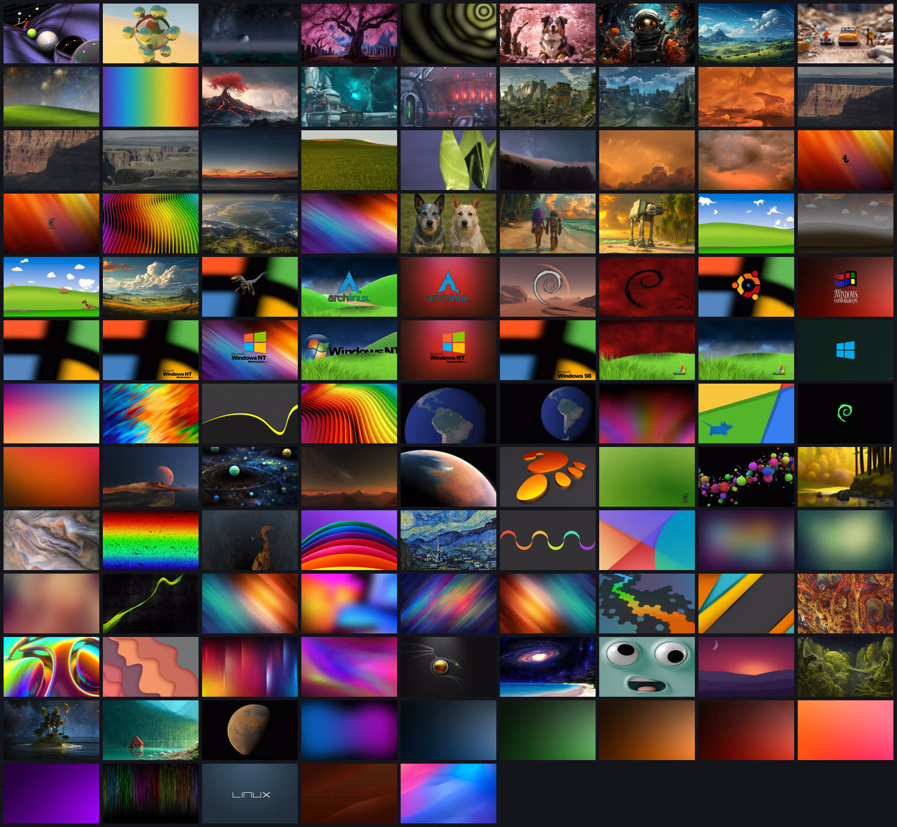

<!-- markdownlint-disable MD007 -- Unordered list indentation -->
<!-- markdownlint-disable MD010 -- No hard tabs -->
<!-- markdownlint-disable MD033 -- No inline html -->
<!-- markdownlint-disable MD055 -- Table pipe style [Expected: leading_and_trailing; Actual: leading_only; Missing trailing pipe] -->
<!-- markdownlint-disable MD041 -- First line in a file should be a top-level heading -->
<div align="center">

[](https://github.com/jim-collier/silkterm/releases)
[](https://www.rust-lang.org/)

[](https://www.gnu.org/licenses/old-licenses/gpl-2.0.html)


[](https://github.com/sponsors/jim-collier)

<!--

[](https://www.gnu.org/software/bash/)
[](https://opensource.org/licenses/MIT)


-->

<!-- TOC ignore:true -->
# SilkTerm


</div>

SilkTerm™ is the only (contemporary) terminal emulator in the known universe that smooth-scrolls lines on output - for a silky-smooth UI you have to see to believe.

It also has smooth cursor blink animation and movement.

The background image and text scrim options are also completely unique.

It has the other requisite features of a modern terminal emulator: tabs, native split-panes, transparency (with blur!), and can run without a menu and/or window decorations.

Cross-platform. Single binary. Written in Rust. GPU accelerated if available.

<!-- Full demo video with sound: [SilkTerm on YouTube](https://www.youtube.com/watch?v=TODO) -->

<!--
<table style="border: none; border-collapse: collapse;">
	<tr style="border: none; border-collapse: collapse;">
		<td style="border: none; border-collapse: collapse;"></td>
		<td style="border: none;">SilkTerm is the only known terminal currently in existence, that smooth-scrolls lines on output - for silky-smooth and less-tiring long terminal sessions. It also has smooth cursor options such as phase effect for blinking, and smooth movement.<br /><br />SilkTerm also has multiple tabs, split-panes, transparency and blur, background image and blur, text scrim, and can run without a menu and/or window decorations.<br /><br />Cross-platform. Written in Rust for a small single executable, and blazing speed.</td>
	</tr style="border: none; border-collapse: collapse;">
</table>
-->

<!-- TOC ignore:true -->
## Table of contents

<!-- TOC -->

- [Why?](#why)
	- [Why smooth-scrolling output](#why-smooth-scrolling-output)
	- [Why text scrim](#why-text-scrim)
- [Features](#features)
- [Wallpaper pack](#wallpaper-pack)
- [Terminal showdown - speed and size](#terminal-showdown---speed-and-size)
- [Getting and using](#getting-and-using)
	- [Installing](#installing)
		- [Packages and installers](#packages-and-installers)
		- [Direct](#direct)
		- [Build it yourself](#build-it-yourself)
	- [Setting up a development environment](#setting-up-a-development-environment)
	- [Configuration](#configuration)
- [Contributing](#contributing)
- [Support SilkTerm](#support-silkterm)
- [Legal stuff](#legal-stuff)

<!-- /TOC -->

## Why?

### Why smooth-scrolling output

Literally *all* other terminal emulators in existence at the time this was written, currently snap scrolling output to fixed lines. Nothing can appear in-between those lines (except when mouse-scrolling on some terminals).

For output that can be sporadic - e.g. something scrolling slowly one line-at-a-time sometimes, then jumping several lines at once other times (e.g. while watching a live log file with `tail -f`), [the eye/brain combo can struggle to track the output](https://www.youtube.com/watch?v=yQaC-ZzTf78), and you get "lost" trying to follow it.

One analogy is playing a video game with mouse-look at, say, 3 frames-per-second visual output. It is nearly impossible to keep your bearings, when the world view jumps wildly from frame-to-frame. But at say 240 FPS on a matching Hz monitor, it looks buttery smooth and immersive, and the subtle task of mentally maintaining where you are, becomes trivial.

As the youtube video linked above goes into, jerky line-snapped output taxes mental resources - however slightly - in a way that stacks up over long sessions. At the extreme, it can contribute to headaches and fatigue. And that's brainpower that could have been used to solve whatever it is you're working on.

The crazy thing is that **several early CRT text-mode computers offered smooth-scrolling**. (For example, many UNIX client terminal consoles of the 80s.)

So when it's said that SilkTerm is "the only one to offer it", that means *now* - not across time.

The smooth-scrolling output concept was completely abandoned in the 80s and 90s, because:

- Rate-limited output scrolling would cap fast output, and possibly overflow the scrollback buffers resulting in lost output.

	- *SilkTerm solves this problem by automatically ramping up the scroll speed, smoothly, as needed to keep up with output speed.*

- Smooth scroll solved the same "tracking-a-moving-line" problem, that scrollback buffers + pagers (such as `more`, `less`) later solved better, with the technology available at the time.

Video examples of early smooth-scroll displays:

- [DEC VT100 - VT420](https://www.youtube.com/watch?v=tSJfzrSA0ec)
- [Wyse WY*nn*](https://www.youtube.com/watch?v=8q6YPAzH02s)

SilkTerm's smooth-scrolling output is a joy to work with, you really have to try it to "get" it. And the faster your monitor display Hz, the more gorgeous it feels.

### Why text scrim

A text *scrim* is a subtle halo drawn behind each glyph - usually of the opposite luminosity to the text - purely as a readability aid. It's the same technique graphic designers reach for as "outer glow" (and distinctly *not* an angled "drop-shadow", which is a creative effect). SilkTerm calls it a scrim because that's its whole job: keeping text legible, not decoration. (Though this isn't a hard-and-fast graphic design "rule" - there's lots of overlap in both directions.)

If you've ever used a terminal that supports background transparency, and/or background images (both of which SilkTerm offers), that novelty can quickly wear off. You'll notice that the text might be too hard to read, particularly in a long computing session.

Text can be particularly hard to read, for example when using light text on a normally dark background, and:

- The background is very transparent, and the terminal is on top of bright and/or visually "busy" content below. And/or,

- The background image is bright.

(*Or vice-versa for dark text on a normally light background, with dark elements under the text.*)

"Drop-shadow" is a feature available on at least a half-dozen other terminal emulators, but apparently only for novelty effect. Because if you use it for very long, it can make your mental workload subtly higher, and your visual cortex tires faster - or something. (I don't know, I'm not a neuroscientist, why are you asking me.)

A scrim like this - "outer glow" or similar techniques by other names (and distinctly *not* angled "drop-shadow") - is used often in graphic design and advertising to aid readability on backgrounds of varying brightness and color. (And some closed-captioning systems use it as an alternative to black bars as a background.)

## Features

- **Smooth pixel-at-a-time scrolling on terminal output**.

	- *You HAVE to see how gorgeous it looks on a high-refresh rate monitor. No animated gif reproduction can do it justice*.

- **Smooth mouse wheel scrolling**. Several other terminals offer this feature.

- **Smooth cursor movement**. This is the cherry on top of "smooth".

- **Text scrim (readability backing)**. This optional feature helps keep text readable even when the text is on top of similar-colored backgrounds and/or when using high background transparency. This is the only known terminal to offer it, though there are several terminals that offer angled *drop-shadow* (which ironically can make text *harder* to read). A scrim is conceptually similar - but enhances, rather than reduces, readability.

- **Cursor size and animation options**. Phased blinking, or smoothly pulsing in size. (Or just regular.) Adjustable rate.

- **Background transparency**. The background (with adjustable %) becomes see-through, but not the text.

- **Background transparency blur**. If using background transparency and this is enabled, everything behind the terminal is blurred. Supported on most window compositors. (But limited to the compositor's options. SilkTerm just talks to the WM to enable it.)

- **User-selectable background image**. Over a hundred are included, or point it at a folder of your own.

	- The background image can be dimmed with adjustable %, relative to the background color - and independent of main background transparency.

- **Background image blur**: With an optional Gaussian blur radius (without altering the source image), also independent of transparency blur.

- **Background image contrast mask**: Flattens the image's local contrast so it stops competing with the text on top of it, again without altering the source image. The flatten scale and strength are adjustable, and can be blended with values derived from the image itself.

- **Background image fit**: Stretch to fill the window, or zoom to cover it while keeping the aspect ratio.

	- An image can also carry its own fit in its XMP metadata (`wallpaper:Fit`, plus a `wallpaper:Anchor` that picks which part of it a zoom crop keeps), overriding the default per image - so a photo isn't squashed while a gradient still fills the window. Read straight from the image file, and switchable off.

- **Split panes**: A native feature to arbitrarily split any pane in either direction. Panes can be freely drag-n-dropped to change locations. Panes split in successive directions are automatically evenly distributed, unless adjusted (with the mouse).

- **Window decorations and/or the menu can be disabled**, for "nothing but terminal". Fullscreen can also be toggled.

- **Robust Unicode and emoji support**. With internal Unicode fallback rendering for the glyphs that the chosen display font can't display.

- **Text brightens on "bell"**. (An idea borrowed from Windows Terminal, surely other as well.)

- **True-color, 256-color, and 16-color text support, as well as standard bold & italic**.

- **Read-only output toggle**.

- **Clickable links**. Hover a URL to underline it, Ctrl+click to open it, or use the right-click menu. Only known-safe schemes are ever treated as links, and an app that has taken over the mouse keeps it.

- **Copy on select, and copy on output**. Both optional, both per-pane. Copy-on-output grabs what a command printed without the prompt around it.

- **Overlay scrollbar**. Thick enough to grab, fades out when you're at the bottom, and takes no columns away from the text.

- **Settings dialog with themes**. Every setting has a control, a flyover explaining it, and a revert arrow back to its default. Three color themes ship, each with a dark and a light variant - edit any color and save the result as a theme of your own.

- **Simple and sane configuration**. No pages of nested tabs representing multiple settings metaphors. (E.g. no separate "Profiles" and "Layouts".) If you want to get fancy with multiple sets of wildly different options - that's easy with alternate config files, and/or scripted launch-time arguments.

- **Rich command-line syntax**: A simple yet (optionally) insanely powerful CLI syntax, that allows creating multiple tabs and/or complex pane structure(s) at launch time.

	- This can be very useful for creating one-line shell scripts that launch custom SilkTerm instances with specific size, background, color, opacity, text and cursor style, and unique shells per window, tab, and/or pane. (Without overwriting the main config file.)

- **Arbitrary alternate config files**, another way to launch SilkTerm with wildly different options, without overwriting the main config file.

- **Written in Rust** as a single self-contained binary - no runtime dependencies - and fast. (Several terminal emulators - such as the revered `terminator` - are written in interpreted Python.) The one binary bundles the entire GPU and text-rendering stack, which is why it's ~10 MiB; [the FAQ explains how that actually compares to a GTK terminal's few-hundred-KiB launcher](FAQ.md).

- **One codebase for Linux + Windows, both with x86_64 and ARM builds**. The Windows and ARM versions all build in one pass on x86_64 Linux. *macOS should build from the same codebase on a Mac, but is untested and no releases target it yet*.

- **Native X11 and Wayland** on Linux from one binary - the display backend is chosen at runtime, with no separate build or wrapper.

- **Loosely based on [Alacritty](https://github.com/alacritty/alacritty)** (not a fork), just for the basement plumbing - to avoid rewriting the complex but solved problems of terminal emulation. Alacritty is also a high-performance, open-source terminal written in Rust.

	- *Fun fact: SilkTerm is about three times the size of the Alacritty terminal core it sits on. That core solves a thoroughly-and-repeatedly-solved problem, so there was no reason to write another one.*

- **GPU-accelerated** with software fallback.

## Wallpaper pack

SilkTerm ships with the 113 wallpapers it was built and tuned against, in [`filesystem/home/.config/silkterm/wallpaper/`](filesystem/home/.config/silkterm/wallpaper/). Put them next to your config and rotation picks one each launch, favoring whatever it hasn't shown lately. Each image carries its own fit and anchor in its metadata, so a photo is cropped rather than squashed while a gradient still stretches edge to edge. Provenance for every one of them is in [wallpaper-attribution.md](filesystem/home/.config/silkterm/wallpaper-attribution.md).

[](filesystem/home/.config/silkterm/wallpaper/)

They come to 60 MiB against a 10 MiB terminal, so no package or installer carries them - fetch the folder on its own. Bash (Linux, macOS, WSL):

```bash
dir="${XDG_CONFIG_HOME:-$HOME/.config}/silkterm" && mkdir -p "$dir" &&
curl -fsSL https://github.com/jim-collier/silkterm/archive/refs/heads/main.tar.gz |
	tar -xz -C "$dir" --strip-components=5 silkterm-main/filesystem/home/.config/silkterm/wallpaper
```

PowerShell (Windows):

```powershell
$dest = "$env:APPDATA\silkterm"; $tgz = "$env:TEMP\silkterm-main.tar.gz"
New-Item -ItemType Directory -Force $dest | Out-Null
curl.exe -fsSL https://github.com/jim-collier/silkterm/archive/refs/heads/main.tar.gz -o $tgz
tar -xzf $tgz -C $dest --strip-components=5 silkterm-main/filesystem/home/.config/silkterm/wallpaper
Remove-Item $tgz
```

Either one lands the images at `wallpaper/` inside your config directory, which is where rotation looks for them. Both pull the whole repository archive, since GitHub serves no smaller unit - about 67 MiB over the wire.

Rendered with [`cicd/utility/wallpaper-gallery.bash`](cicd/utility/wallpaper-gallery.bash), which rebuilds the contact sheet above whenever the pack changes.

## Terminal showdown - speed and size

Smooth scrolling counts for nothing if the terminal falls behind the moment something dumps a lot of text, so throughput is measured rather than asserted. In testing, each terminal is fed byte-identical, deterministic streams of one UTF-8 width class at a time - plain ASCII, then 2-byte, 3-byte and 4-byte characters, then a mix - and timed to a device-attributes reply, so the clock stops when the terminal has genuinely consumed the stream rather than when the pipe accepted it. Speed is measured at a 160x42 grid.

A terminal is also the program that is always open, usually several times over, so what it costs while doing nothing matters. Size and memory are measured separately, with each terminal at a 100x30 grid and its own defaults.

Sorted by speed. Terminals not yet measured for speed follow, ordered by what it takes to install them.

<!-- termbench:begin -->

| OS<sup>9</sup> | Terminal | Ver | 1-byte<sup>1</sup> | 4-byte<sup>1</sup> | Speed score<sup>2</sup> | File size<sup>3</sup> (MiB) | File+ deps<sup>4</sup> (MiB) | Mem<sup>4</sup> (MiB) |
| --- | --- | --- | ---: | ---: | ---: | ---: | ---: | ---: |
| \[multi\] | $\textcolor{limegreen}{SilkTerm}$ plain<sup>6</sup> | 1.0.0 | 86.9 | 129.3 | **71.1** | **10.5** | **14.1** | **100.1** |
| \[multi\] | Alacritty<sup>8</sup> | 0.15.1 | 79.8 | 129.1 | **68.4** | 8.5 | 12.7 | 50.4 |
| \[multi\] | $\textcolor{limegreen}{SilkTerm}$ +candy<sup>5</sup> | 1.0.0 | 77.4 | 135.1 | **67.6** | **10.5** | **14.1** | **167.7** |
| Linux | GNOME Terminal | 3.58.1 | 100.2 | 62.6 | **55.3** | 0.4 | 84.0 | 53.6 |
| Linux | XFCE4 Terminal | 1.2.0 | 94.2 | 65.0 | **54.0** | 0.3 | 84.1 | 48.6 |
| Linux | Terminator | 3.13.5 | 87.8 | 67.3 | **51.8** | script | 92.6 | 82.2 |
| Linux | XTerm | 407 | 28.3 | 48.5 | **23.9** | 0.9 | 6.0 | 9.4 |
| \[multi\] | kitty | 0.48.1 | 24.2 | 59.6 | **22.6** | 0.2 | 115.0 | 140.8 |
| \[multi\] | WezTerm | 20240203 | 15.6 | 22.2 | **10.4** | 70.5 | 129.9 | 84.8 |
| \[multi\] | Tabby | 1.0.235 | 8.5 | 9.0 | **5.7** | 192.1 | 454.2 | 473.4 |
| Win | conhost.exe | - | - | - | - | 1.0 | 1.0 | 21.1 |
| Win | PuTTY | - | - | - | - | 1.6<sup>7</sup> | - | - |
| Linux | Guake | - | - | - | - | 1.7<sup>7</sup> | - | - |
| Linux | Konsole | - | - | - | - | 7.3<sup>7</sup> | - | - |
| \[multi\] | Windows Terminal | - | - | - | - | 11.1<sup>7</sup> | 14.2 | 93.0 |
| \[multi\] | Ghostty | - | - | - | - | 32.0<sup>7</sup> | - | - |
| macOS | iTerm2 | - | - | - | - | 43.0<sup>7</sup> | - | - |
| Win | MobaXterm | - | - | - | - | 43.4<sup>7</sup> | - | - |
| \[multi\] | Hyper | - | - | - | - | 147.8 | 300.9 | 309.4 |
| macOS | Terminal.app | - | - | - | - | - | - | - |
| macOS | Warp | - | - | - | - | - | - | - |

<!-- termbench:end -->

<sub><sup>1</sup> Throughput in MB/s, higher is better, on a stream made entirely of characters of that UTF-8 width - 1-byte is plain ASCII, 4-byte is emoji. Two more width classes and a mixed stream are measured as well and count toward the score; the tool prints all five. Only rows measured at the same grid size are comparable.</sub>

<sub><sup>2</sup> Millions of cells per second - the weighted geometric mean of all five classes, leaning toward plain ASCII since that is most of what a terminal ever sees, and geometric so no single class can dominate. Counted in cells rather than bytes, because a wide-character stream moves far more bytes for the same amount of screen. It says how fast a terminal swallows output and keeps up, not how fast it rasterizes glyphs - only a screenful is ever visible, so most of a large stream is parsed, stored and scrolled past. The clock stops when the terminal answers a query that it can only answer once it has worked through everything queued, so a terminal that never answers cannot be timed this way and its speed cells stay blank. A slow terminal gets fewer repetitions of the same payloads, which makes its figures noisier but no less comparable.</sub>

<sub><sup>3</sup> This number is near-meaningless alone. A small executable usually means the code sits in shared libraries instead. But they are loaded only once however many programs map them - so anything built on a stack the desktop already loads costs less than its File+deps implies. SilkTerm links nothing beyond the C runtime and what the graphics stack loads at runtime (for maximum portability and long-term stability without "bitrot"), so almost all of it is in the one file.</sub>

<sub><sup>4</sup> File+deps is the executable plus everything else it needs beyond a base OS. Memory is the unique resident footprint of the whole process tree - private pages, plus each shared mapping counted once. Self-contained bundles count their extracted payload plus the system libraries they still borrow. Both columns leave out the graphics stack and what it pulls in, because accelerated terminals share it with the compositor and every other accelerated program: 141 SilkTerm, 105 WezTerm, 73 kitty and Alacritty, 48 Tabby, 1 Hyper. "A base OS" is not the same size on every platform - on Linux it means the C runtime and nothing else, since a desktop library is something you installed, while on Windows the whole of System32 ships with the machine - so a Windows row counts less toward File+deps than a Linux one, on top of everything in note 9. Expect a few MiB of drift between runs, since libraries load on demand.</sub>

<sub><sup>5</sup> SilkTerm as it ships, with the eye candy on: wallpaper, text scrim and outline, animated cursor, smooth application scrolling and color emoji. Every one of them is a setting, and the row below is the same binary with the lot switched off.</sub>

<sub><sup>6</sup> Wallpaper, scrim, outline, cursor animation, smooth app scrolling, transparency and color emoji all off.</sub>

<sub><sup>7</sup> Vendor's released artifact, not measured here, so not comparable with the measured columns. Blank: conhost.exe and Terminal.app ship inside the OS, Warp publishes no size, and the macOS rows have nothing here to run on.</sub>

<sub><sup>8</sup> SilkTerm uses Alacritty's terminal-emulation core, so the two share the parsing and grid work that this benchmark mostly measures - which is why they are within a few percent of each other, and why both sit so far ahead of terminals that parse their own way. It is the lighter of the two to run, which is what the eye candy costs: SilkTerm with everything switched off is 50 MiB above it, and as it ships, 117.</sub>

<sub><sup>9</sup> Every measured row comes from one machine, because the measuring rig is not neutral: rendering through software OpenGL roughly halves SilkTerm's throughput and going through VirtualGL still costs it about 14%, while terminals that draw on the CPU do not move at all. A table built from mixed rigs can therefore rank the wrong terminal first. These figures were taken on a headless Wayland compositor driving a discrete GPU (Linux, Ryzen host, GeForce RTX 3060 Ti), so nothing on the desktop competes for the card. <b>There are no Windows rows, and there will not be.</b> On Windows a terminal never receives its output directly: the child writes into a console host, which relays the bytes over a pipe. On the measuring machine a consumer that reads that pipe and throws the bytes away is done with 32 MiB in 1.45 s, and nothing moves it - pipe buffers from the default to 16 MB, reads from 64 KB to 1 MB, and Microsoft's own redistributable console host all land inside the noise. Any Windows terminal near that figure is showing the transport rather than itself. The high Windows throughput numbers reported anywhere, this benchmark included, are worse than merely ambiguous: they measure how fast bytes are ACCEPTED into buffers, not consumed - bundling the same console host beside SilkTerm takes its writer-visible rate from 12.4 to 85.8 MB/s while the terminal still finishes at the same moment. Sampling past the last write gives the only honest end-to-end figures available: Windows Terminal settles in about 1.3 s against SilkTerm's 2.5 s, roughly 2x, of which 1.45 s is the transport both of them pay, about 0.5 s is parsing, and the rest is pipe plumbing in the terminal engine we depend on. The renderer is not in it at all - capping the frame rate at 5, 20, 30 or 60 changes the time by nothing. A cross-platform correction factor is dead too: SilkTerm measures 6.98x its own Linux row where WezTerm measures 2.93x its own, so no single multiplier serves the table. The size and memory columns are unaffected by any of this, which is why Windows rows appear there.</sub>

Run it yourself with [`utility/update-showdown.py`](utility/update-showdown.py) (`--quick` for a thirty-second version). It needs only Python 3 and a terminal, works on any emulator on any OS, and refreshes the speed columns above as more terminals are measured.

## Getting and using

### Installing

#### Packages and installers

The primary install is a native package from the [releases page](https://github.com/jim-collier/silkterm/releases): `.deb` / `.rpm` on Linux, or the NSIS setup `.exe` on Windows. (No releases published yet? Build it yourself, below.) Optional either way: copy the example config tree in [`filesystem/home/`](filesystem/home/) over your own `$HOME` for a starter config and the background image pack.

#### Direct

Prefer a plain binary? These one-liners work out your operating system and CPU on their own, download the release built for it, verify its sha256, and install it. Each prints what it is about to do and asks before touching anything, and does nothing at all when you are already up to date. The defaults suit most people - add `--help` for the handful of things you can change.

Bash 3.2 or newer (Linux, macOS, WSL):

```bash
bash <(curl -fsSL https://raw.githubusercontent.com/jim-collier/silkterm/main/install.bash)
```

PowerShell 5.1 or 7+ (Windows, Linux, macOS):

```powershell
irm https://raw.githubusercontent.com/jim-collier/silkterm/main/install.ps1 | iex
```

PowerShell needs the script-block form to pass anything, `-Help` included:

```powershell
& ([scriptblock]::Create((irm 'https://raw.githubusercontent.com/jim-collier/silkterm/main/install.ps1'))) -Help
```

Install locations:

| OS      | User install (default)                    | <- Launcher                                                     | (or) System install       | <- Launcher
| :---    | :---                                      | :---                                                            | :---                      | :---
| Linux   | `~/.local/bin/silkterm`                   | `~/.local/share/applications/silkterm.desktop`                  | `/usr/local/bin/silkterm` | `/usr/local/share/applications/silkterm.desktop`
| Windows | `%LOCALAPPDATA%\Programs\SilkTerm\`       | Start Menu shortcut, and the install dir is added to `%PATH%`   | `C:\Program Files\SilkTerm\` | Common Start Menu shortcut (needs an elevated shell)

Only Linux and Windows binaries are published so far. On anything else the installer says so and lists what the release does carry, so build it yourself - below.

#### Build it yourself

Install the per-platform prerequisites first ([prerequisites.md](prerequisites.md)), then on Linux:

```bash
cargo run --release
```

That's the whole of it for a native build. [build.md](build.md) covers the cross-builds (Windows, and ARM64 for both) which all run from an x86_64 Linux box.

### Setting up a development environment

[prerequisites.md](prerequisites.md) lists what each platform needs, down to the package names and the one-time toolchain setup. [build.md](build.md) covers the build and cross-build commands, and [contributing.md](contributing.md) covers the branch and review flow.

The toolchain version is pinned in `rust-toolchain.toml`, so rustup picks the right one on its own.

To run everything a change has to pass before it can be pushed - format, lint, regression tests, profiling, the release and cross builds, packaging, then backup and publish:

```bash
cicd/cicd.bash [--quick]
```

`--quick` skips the cross-builds and the slow stages. A fast subset of it - format check, lint, tests - also runs as a pre-push hook (`cicd/cicd.bash --gate`), so nothing reaches a shared branch unverified.

### Configuration

On first run SilkTerm writes a commented config file with all defaults to:

```bash
$XDG_CONFIG_HOME/silkterm/config.shcl   (falls back to ~/.config/...)
```

If making changes directly (rather than through Settings), you can apply them immediately with the "Reload config" menu item.

To start over from the shipped defaults, run `silkterm --reset-config`. The old file is kept alongside as `config.shcl.bak` rather than deleted.

Drop a few images into a `wallpaper` folder next to the config and SilkTerm picks one each launch, favoring whatever it hasn't shown lately. Naming a wallpaper in the config, or passing one on the command line, takes precedence. The [wallpaper pack](#wallpaper-pack) is a ready-made folder to start from.

<!--
## Renaming the project

The display name lives in one place (`APP_NAME` in `source/src/config.rs`); the lowercase identifier (`silkterm`) is the cargo package, binary, and config directory. To rename everything at once during development:

```sh
utility/rename.bash NewName
cargo build
```

It rewrites `Cargo.toml`, the Rust sources, and the docs (review `git diff`
afterwards); `cargo build` regenerates `Cargo.lock`.
-->

## Contributing

Bug reports, feature ideas, and pull requests are welcome. See [contributing.md](contributing.md) for how to get started, and the [style guide](style-guide.md) for naming, comments, Rust conventions, and formatting.

## Support SilkTerm

SilkTerm is written and maintained by one programmer in his spare time. If you like this thing, use it often, and/or it saves you time - sponsoring it keeps it moving!

Even a few dollars a month is meaningful. Or just buy me a coffee.

**Direct support**

- [GitHub Sponsors](https://github.com/sponsors/jim-collier)

**Indirect support**

- Star the repo.
- File good bug reports and feature requests.

**Get the word out**

Tell other terminal nerds on various socials how this has changed your life!

- [r/commandline](https://www.reddit.com/r/commandline/)
- [Hacker News](https://news.ycombinator.com/)
- [r/unixporn](https://www.reddit.com/r/unixporn/)

## Legal stuff

SilkTerm is built on the basic plumbing of [Alacritty](https://github.com/alacritty/alacritty), which is dual-licensed under the [Apache License, Version 2.0](https://github.com/alacritty/alacritty/blob/master/LICENSE-APACHE) and [MIT License](https://github.com/alacritty/alacritty/blob/master/LICENSE-MIT).

SilkTerm's license is specifically compatible with Alacritty's:

> Copyright © 2026 Jim Collier (CryptogID: ѳ6ᴚ℈𐀘𐇦ɛ𐊁¥Mﾏb϶Δ𐌞)<br />
> Licensed under the [GNU General Public License v2.0 or later](https://spdx.org/licenses/GPL-2.0-or-later.html)<br /> SPDX-License-Identifier: `GPL-2.0-or-later` <br />
> No warranty.<br />
> SilkTerm™ is a [trademark](trademark.md) of Jim Collier.
