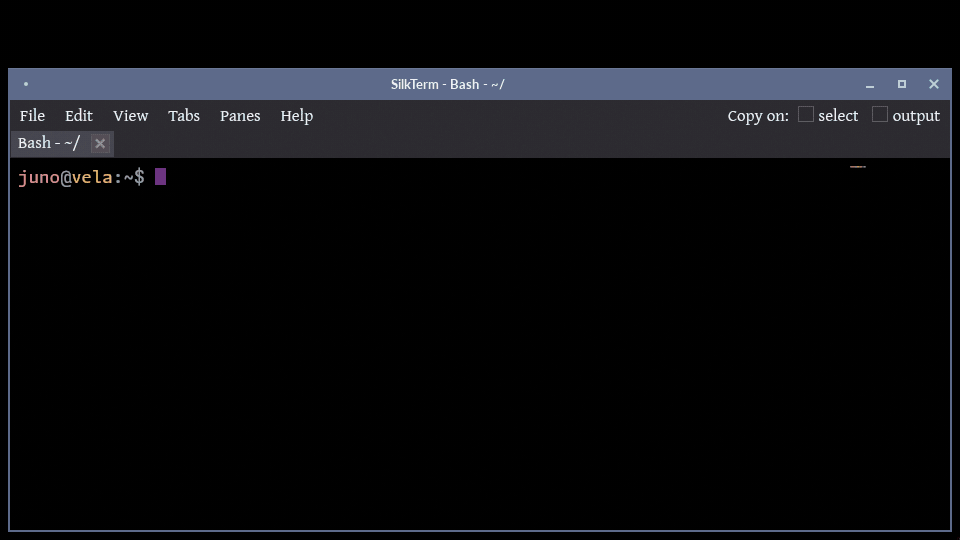

<!-- markdownlint-disable MD007 -- Unordered list indentation -->
<!-- markdownlint-disable MD010 -- No hard tabs -->
<!-- markdownlint-disable MD033 -- No inline html -->
<!-- markdownlint-disable MD055 -- Table pipe style [Expected: leading_and_trailing; Actual: leading_only; Missing trailing pipe] -->
<!-- markdownlint-disable MD041 -- First line in a file should be a top-level heading -->
<div align="center">

[](https://github.com/jim-collier/silkterm/releases)
[](https://www.rust-lang.org/)

[](https://www.gnu.org/licenses/old-licenses/gpl-2.0.html)


[](https://github.com/sponsors/jim-collier)

<!--

[](https://www.gnu.org/software/bash/)
[](https://opensource.org/licenses/MIT)


-->

<!-- TOC ignore:true -->
# SilkTerm



</div>

SilkTerm™ is the only (contemporary) terminal emulator in the known universe that smooth-scrolls lines on output - for a silky-smooth UI you have see to believe.

It also has smooth cursor blink animation and movement.

The background image and text scrim options are also completely unique.

It has the other requisite features of a modern terminal emulator: detachable multi-tabs, native split-panes, transparency (with blur!), and can run without a menu and/or window decorations.

Cross-platform. Single binary. Written in Rust. GPU accelerated if available.

<!-- Full demo video with sound: [SilkTerm on YouTube](https://www.youtube.com/watch?v=TODO) -->

<!--
<table style="border: none; border-collapse: collapse;">
	<tr style="border: none; border-collapse: collapse;">
		<td style="border: none; border-collapse: collapse;"></td>
		<td style="border: none;">SilkTerm is the only known terminal currently in existence, that smooth-scrolls lines on output - for silky-smooth and less-tiring long terminal sessions. It also has smooth cursor options such as phase effect for blinking, and smooth movement.<br /><br />SilkTerm also has detachable multi-tabs, split-panes, transparency and blur, background image and blur, text scrim, and can run without a menu and/or window decorations.<br /><br />Cross-platform. Written in Rust for a small single executable, and blazing speed.</td>
	</tr style="border: none; border-collapse: collapse;">
</table>
-->

<!-- TOC ignore:true -->
## Table of contents

<!-- TOC -->

- [Why?](#why)
	- [Why smooth-scrolling output](#why-smooth-scrolling-output)
	- [Why text scrim](#why-text-scrim)
- [Features](#features)
	- [One minor limitation inherent to all terminals](#one-minor-limitation-inherent-to-all-terminals)
- [Speed](#speed)
- [Size](#size)
- [Getting and using](#getting-and-using)
	- [Installing](#installing)
		- [Direct](#direct)
	- [Building from source](#building-from-source)
	- [Configuration](#configuration)
- [Contributing](#contributing)
- [Support SilkTerm](#support-silkterm)
- [Legal stuff](#legal-stuff)

<!-- /TOC -->

## Why?

### Why smooth-scrolling output

Literally *all* other terminal emulators in existence at the time this was written, currently snap scrolling output to fixed lines. Nothing can appear in-between those lines (except when mouse-scrolling on some terminals).

For output that can be sporadic - e.g. something scrolling slowly one line-at-a-time sometimes, then jumping several lines at once other times (e.g. while watching a live log file with `tail -f`), [the eye/brain combo can struggle to track the output](https://www.youtube.com/watch?v=yQaC-ZzTf78), and you get "lost" trying to follow it.

One analogy is playing a video game with mouse-look at, say, 3 frames-per-second visual output. It is nearly impossible to keep your bearings, when the world view jumps wildly from frame-to-frame. But at say 240 FPS on a matching Hz monitor, it looks buttery smooth and immersive, and the subtle task of mentally maintaining where you are, becomes trivial.

As the youtube video linked above goes into, jerky line-snapped output taxes mental resources - however slightly - in a way that stacks up over long sessions. At the extreme, it can contribute to headaches and fatigue. And that's brainpower that could have been used to solve whatever it is you're working on.

The crazy thing is that **several early CRT text-mode computers offered smooth-scrolling**. (For example, many UNIX client terminal consoles of the 80's.)

So when it's said that SilkTerm is "the only one to offer it", that means *now* - not across time.

The smooth-scrolling output concept was completely abandoned in the 80s and 90s, because:

- Rate-limited output scrolling would cap fast output, and possibly overflow the scrollback buffers resulting in lost output.

	- *SilkTerm solves this problem by automatically ramping up the scroll speed, smoothly, as needed to keep up with output speed.*

- Smooth scroll solved the same "tracking-a-moving-line" problem, that scrollback buffers + pagers (such as `more`, `less`) later solved better, with the technology available at the time.

Video examples of early smooth-scroll displays:

- [DEC VT100 - VT420](https://www.youtube.com/watch?v=tSJfzrSA0ec)
- [Wyse WY*nn*](https://www.youtube.com/watch?v=8q6YPAzH02s)

SilkTerm's smooth-scrolling output is a joy to work with, you really have to try it to "get" it. And the faster your monitor display Hz, the more gorgeous it feels.

### Why text scrim

A text *scrim* is a subtle halo drawn behind each glyph - usually of the opposite luminosity to the text - purely as a readability aid. It's the same technique graphic designers reach for as "outer glow" (and distinctly *not* an angled "drop-shadow", which is a creative effect). SilkTerm calls it a scrim because that's its whole job: keeping text legible, not decoration. (Though this isn't a hard-and-fast graphic design "rule" - there's lots of overlap in both directions.)

If you've ever used a terminal that supports background transparency, and/or background images (both of which SilkTerm offers), that novelty can quickly wear off. You'll notice that the text might be too hard to read, particularly in a long computing session.

Text can be particularly hard to read, for example when using light text on a normally dark background, and:

- The background is very transparent, and the terminal is on top of bright and/or visually "busy" content below. And/or,

- The background image is bright.

(*Or vice-versa for dark text on a normally light background, with dark elements under the text.*)

"Drop-shadow" is a feature available on at least a half-dozen other terminal emulators, but apparently only for novelty effect. Because if you use it for very long, it can make your mental workload subtly higher, and your visual cortex tires faster - or something. (I don't know, I'm not a neuroscientist, why are you asking me.)

A scrim like this - "outer glow" or similar techniques by other names (and distinctly *not* angled "drop-shadow") - is used often in graphic design and advertising to aid readability on backgrounds of varying brightness and color. (And some closed-captioning systems use it as an alternative to black bars as a background.)

## Features

- **Smooth pixel-at-a-time scrolling on terminal output**.

	- *You HAVE to see how gorgeous it looks on a high-refresh rate monitor. No animated gif reproduction can do it justice*.

- **Smooth mouse wheel scrolling**. Several other terminals offer this feature.

- **Smooth cursor movement**. This is the cherry on top of "smooth".

- **Text scrim (readability backing)**. This optional feature helps keep text readable even when the text is on top of similar-colored backgrounds and/or when using high background transparency. This is the only known terminal to offer it, though there are several terminals that offer angled *drop-shadow* (which ironically can make text *harder* to read). A scrim is conceptually similar - but enhances, rather than reduces, readability.

- **Cursor size and animation options**. Phased blinking, or smoothly pulsing in size. (Or just regular.) Adjustable rate.

- **Background transparency**. The background (with adjustable %) becomes see-through, but not the text.

- **Background transparency blur**. If using background transparency and this is enabled, everything behind the terminal is blurred. Supported on most window compositors. (But limited to the compositor's options. SilkTerm just talks to the WM to enable it.)

- **User-selectable background image**. User-selectable, with a few dozen cool offerings included.

	- The background image can be dimmed with adjustable %, relative to the background color - and independent of main background transparency.

- **Background image blur**: With an optional Gaussian blur radius (without altering the source image), also independent of transparency blur.

- **Split panes**: A native feature to arbitrarily split any pane in either direction. Panes can be freely drag-n-dropped to change locations. Panes split in successive directions are automatically evenly distributed, unless adjusted (with the mouse).

- **Window decorations and/or the menu can be disabled**, for "nothing but terminal". Fullscreen can also be toggled.

- **Robust Unicode and emoji support**. With internal Unicode fallback rendering for the glyphs that the chosen display font can't display.

- **Text brightens on "bell"**. (An idea borrowed from Windows Terminal, surely other as well.)

- **True-color, 256-color, and 16-color text support, as well as standard bold & italic**.

- **Read-only output toggle**.

- **Simple and sane configuration**. No pages of nested tabs representing multiple settings metaphors. (E.g. no separate "Profiles" and "Layouts".) If you want to get fancy with multiple sets of wildly different options - that's easy with alternate config files, and/or scripted launch-time arguments.

- **Rich command-line syntax**: A simple yet (optionally) insanely powerful CLI syntax, that allows creating multiple tabs and/or complex pane structure(s) at launch time.

	- This can be very useful for creating one-line shell scripts that launch custom SilkTerm instances with specific size, background, color, opacity, text and cursor style, and unique shells per window, tab, and/or pane. (Without overwriting the main config file.)

- **Arbitrary alternate config files**, another way to launch SilkTerm with wildly different options, without overwriting the main config file.

- **Written in Rust** as a single self-contained binary - no runtime dependencies - and fast. (Several terminal emulators - such as the revered `terminator` - are written in interpreted Python.) The one binary bundles the entire GPU and text-rendering stack, which is why it's ~10 MiB; [the FAQ explains how that actually compares to a GTK terminal's few-hundred-KiB launcher](FAQ.md).

- **One codebase for Linux + Windows, both with x86_64 and ARM builds**. The Window and/or ARM versions can be built all at once on x86_64 Linux. *MacOS is built natively on a Mac from the same codebase, but is so far untested (no releases target it yet)*.

- **Native X11 and Wayland** on Linux from one binary - the display backend is chosen at runtime, with no separate build or wrapper.

- **Loosely based on [Alacritty](https://github.com/alacritty/alacritty)** (not a fork), just for the basement plumbing - to avoid rewriting the complex but solved problems of terminal emulation. Alacritty is also a high-performance, open-source terminal written in Rust.

	- *Fun fact: SilkTerm has more lines of code than Alacritty, especially compared to the subset we use. Which is part of why we chose it for the bare guts without reinventing a thoroughly-and-repeatedly-invented wheel.*

- **GPU-accelerated** with software fallback.

### One minor limitation inherent to all terminals

- SilkTerm can only smooth-scroll text written to `stdout` and `stderr`.

	- This covers the overwhelming majority of Linux terminal tools and programs.

	- However, some TUI programs - such as `nano`, `vim`, `tmux` - directly control the terminal buffer in "raw mode", and handle everything themselves. Scrolling within such programs behaves the same as on any other terminal - snapped to lines, no in-between.

		- But the other features still work in that case: smooth-moving and phased cursor, text scrim, background options, etc.

## Speed

Smooth scrolling is worth nothing if the terminal falls behind the moment something dumps a lot of text, so throughput is measured rather than asserted. Each terminal is fed byte-identical, deterministic streams of one UTF-8 width class at a time - plain ASCII, then 2-byte, 3-byte and 4-byte characters, then a mix - and timed to a device-attributes reply, so the clock stops when the terminal has genuinely consumed the stream rather than when the pipe accepted it.

<!-- termbench:begin -->

| Terminal | Version | Grid | 1-byte | 2-byte | 3-byte | 4-byte | Mixed | Score |
| --- | --- | :-: | ---: | ---: | ---: | ---: | ---: | ---: |
| SilkTerm | 1.0.0-beta2+20260728-072224 | 160x42 | 93.2 | 130.7 | 108.1 | 137.6 | 91.8 | **75.1** |
| xfce4-terminal | 1.2.0 | 160x42 | 103.3 | 79.9 | 60.9 | 70.0 | 59.6 | **58.5** |
| XTerm | 407 | 160x42 | 29.2 | 39.1 | 39.3 | 49.8 | 33.5 | **24.5** |

<sub>Throughput in MB/s by UTF-8 width class, higher is better; score is millions of cells per second, a weighted geometric mean so no single class dominates it. This is how fast a terminal swallows output and keeps up, not a glyph rasterization rate - only a screenful is ever visible, so most of the stream is parsed, stored and scrolled past. Every terminal is fed byte-identical deterministic payloads and timed to a device-attributes reply, so the clock stops when the terminal has genuinely consumed the stream rather than when the pipe accepted it. Only rows measured at the same grid size are comparable. Reproduce with <code>utility/termbench.py</code>.</sub>

<!-- termbench:end -->

Run it yourself with [`utility/termbench.py`](utility/termbench.py) (`--quick` for a thirty-second version). It needs only Python 3 and a terminal, works on any emulator on any OS, and appends to this table as more terminals are measured.

## Size

A terminal is the program that is always open, usually several times over, so what it costs while doing nothing is worth knowing. Sorted by what it takes to install: the executable plus everything else it needs beyond a base OS.

| Platform | Terminal | Bin+deps<sup>1</sup> (MiB) | Raw bin<sup>2</sup> (MiB) | Memory<sup>1</sup> (MiB) | Largest dependencies<sup>3</sup> |
| --- | --- | ---: | ---: | ---: | --- |
| Linux | xterm | 6.0 | 0.9 | 9.4 | libX11, FreeType, libXaw |
| Cross-platform | $\textcolor{limegreen}{\textbf{SilkTerm}}$ | **17.4** | **13.2** | **121.4** | libX11, libsystemd, libdbus |
| Cross-platform | $\textcolor{limegreen}{\textbf{SilkTerm (plain)}}$<sup>4</sup> | **17.4** | **13.2** | **76.1** | libX11, libsystemd, libdbus |
| Linux | GNOME Terminal | 84.0 | 0.4 | 53.6 | ICU, GTK, librsvg |
| Linux | XFCE4 Terminal | 84.1 | 0.3 | 48.6 | ICU, GTK, librsvg |
| Linux | Terminator | 92.6 | script | 82.2 | ICU, GTK, libcrypto |
| Cross-platform | kitty | 115.0 | 0.2 | 140.8 | libcrypto, libpython, HarfBuzz |
| Cross-platform | WezTerm | 129.9 | 70.5 | 84.8 | libcrypto, libX11, FreeType |
| Cross-platform | Hyper | 300.9 | 147.8 | 309.4 | GTK, libGLESv2, libvulkan |
| Cross-platform | Tabby | 454.2 | 192.1 | 473.4 | GTK, libGLESv2, SwiftShader |
| Windows | PuTTY | - | 1.6<sup>5</sup> | - | - |
| Linux | Guake | - | 1.7<sup>5</sup> | - | - |
| Linux | Konsole | - | 7.3<sup>5</sup> | - | - |
| Cross-platform | Windows Terminal | - | 11.1<sup>5</sup> | - | - |
| Cross-platform | Ghostty | - | 32.0<sup>5</sup> | - | - |
| macOS | iTerm2 | - | 43.0<sup>5</sup> | - | - |
| Windows | MobaXterm | - | 43.4<sup>5</sup> | - | - |
| Windows | conhost.exe | - | - | - | - |
| macOS | Terminal.app | - | - | - | - |
| macOS | Warp | - | - | - | - |

<sub><sup>1</sup> Measured on one Linux x86_64 machine, each terminal at a 100x30 grid with its own defaults. Memory is the unique resident footprint of the whole process tree - private pages, plus each shared mapping counted once. Self-contained bundles count their extracted payload plus the system libraries they still borrow. Both columns leave out the graphics stack, and anything only it pulls in, because accelerated terminals share it with the compositor and every other accelerated program: 108 SilkTerm, 105 WezTerm, 73 kitty, 48 Tabby, 1 Hyper. Expect a few MiB of drift between runs, since libraries load on demand.</sub>

<sub><sup>2</sup> Near-meaningless alone. A small executable usually means the code sits in shared libraries instead, and those are held in memory once however many programs map them - so anything built on a stack the desktop already loads costs less than its Bin+deps implies. SilkTerm links nothing but the C runtime, so its binary is the whole of it.</sub>

<sub><sup>3</sup> Shared libraries only, largest first. Whatever is linked into the executable lands in Raw bin instead - which is where the Electron terminals keep Chromium.</sub>

<sub><sup>4</sup> Wallpaper, scrim, outline, cursor animation, smooth app scrolling, transparency and colour emoji all off.</sub>

<sub><sup>5</sup> Vendor's released artifact, not measured here, so not comparable with the measured columns. Blank: conhost.exe and Terminal.app ship inside the OS, Warp publishes no size, and nothing in the Windows or macOS rows runs on the measuring machine.</sub>

## Getting and using

### Installing

The primary install is a native package from the [releases page](https://github.com/jim-collier/silkterm/releases): `.deb` / `.rpm` on Linux, or the NSIS setup `.exe` on Windows. (No releases published yet? Build from source per the section below.) Optional either way: copy the example config tree in [`filesystem/home/`](filesystem/home/) over your own `$HOME` for a starter config and the background image pack.

#### Direct

Prefer a plain binary? These one-liners download the latest release, verify its sha256, and install it. Each states its plan and asks before touching anything, and does nothing if you're already current.

Bash >= 3.2 (Linux, WSL):

```bash
bash <(curl -fsSL https://raw.githubusercontent.com/jim-collier/silkterm/main/install.bash)  [--release stable|dev]  [--target user|system]  [--arch x64|arm64]
```

PowerShell 7+ (Windows, Linux):

```powershell
& ([scriptblock]::Create((irm 'https://raw.githubusercontent.com/jim-collier/silkterm/main/install.ps1')))  [-Release stable|dev]  [-Target user|system]  [-Arch x64|arm64]
```

Install locations:

| OS      | User install (default)                    | ￩ Launcher                                                      | (or) System install       | ￩ Launcher
| :---    | :---                                      | :---                                                            | :---                      | :---
| Linux   | `~/.local/bin/silkterm`                   | `~/.local/share/applications/silkterm.desktop`                  | `/usr/local/bin/silkterm` | `/usr/local/share/applications/silkterm.desktop`
| Windows | `%LOCALAPPDATA%\Programs\SilkTerm\`       | Start Menu shortcut, and the install dir is added to `%PATH%`   | `C:\Program Files\SilkTerm\` | Common Start Menu shortcut (needs an elevated shell)

macOS and BSD builds aren't published yet - build from source below.

### Building from source

Install the per-platform prerequisites first: [prerequisites.md](prerequisites.md). Then see [build.md](build.md) for the build commands.

Quick start on Linux:

```bash
cargo run --release
```

Or for the full CI/CD pipeline (lint, debug compile, regression test, profile, release builds, versioned backup, commit to git, push):

```bash
cicd/cicd.bash [--quick]
```

### Configuration

On first run SilkTerm writes a commented config file with all defaults to:

```bash
$XDG_CONFIG_HOME/silkterm/config.toml   (falls back to ~/.config/...)
```

If making changes directly (rather than through Settings), you can apply them immediately with the "Reload config" menu item.

<!--
## Renaming the project

The display name lives in one place (`APP_NAME` in `source/src/config.rs`); the lowercase identifier (`silkterm`) is the cargo package, binary, and config directory. To rename everything at once during development:

```sh
utility/rename.bash NewName
cargo build
```

It rewrites `Cargo.toml`, the Rust sources, and the docs (review `git diff`
afterwards); `cargo build` regenerates `Cargo.lock`.
-->

## Contributing

Bug reports, feature ideas, and pull requests are welcome. See [contributing.md](contributing.md) for how to get started, and the [style guide](style-guide.md) for naming, comments, Rust conventions, and formatting.

## Support SilkTerm

SilkTerm is written and maintained by one programmer in his spare time. If you like this thing, use it often, and/or it saves you time - sponsoring it keeps it moving!

Even a few dollars a month is meaningful. Or just buy me a coffee.

**Direct support**

- [GitHub Sponsors](https://github.com/sponsors/jim-collier)

**Indirect support**

- Star the repo.
- File good bug reports and feature requests.

**Get the word out**

Tell other terminal nerds on various socials how this has changed your life!

- [r/commandline](https://www.reddit.com/r/commandline/)
- [Hacker News](news.ycombinator.com)
- [r/unixporn](https://www.reddit.com/r/unixporn/)

## Legal stuff

SilkTerm is build on the basic plumbing of [Alacritty](https://github.com/alacritty/alacritty), which is dual-licensed under the [Apache License, Version 2.0](https://github.com/alacritty/alacritty/blob/master/LICENSE-APACHE) and [MIT License](https://github.com/alacritty/alacritty/blob/master/LICENSE-MIT).

SilkTerm's license is specifically compatible with Alacritty's:

> Copyright © 2026 Jim Collier (CryptogID: ѳ6ᴚ℈𐀘𐇦ɛ𐊁¥Mﾏb϶Δ𐌞)<br />
> Licensed under the [GNU General Public License v2.0 or later](https://spdx.org/licenses/GPL-2.0-or-later.html)<br /> SPDX-License-Identifier: `GPL-2.0-or-later` <br />
> No warranty.<br />
> SilkTerm™ is a [trademark](trademark.md) of Jim Collier.
